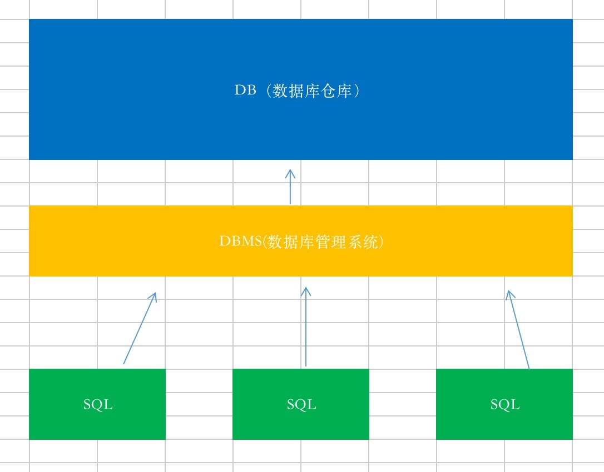

## 数据库相关概念

- DB

  数据库(database) : 存储数据的仓库，它保存了一系列的组织数据。

- DBCMS

  数据库管理系统(DataBase Management System) 。数据库是通过DBMS创建和操作的容器。

- SQL

  结果化查询语句(Structure Query Language) , 专门用来与数据库通信的语言。

- 三者之间的关系

  

- DDL

  数据定义语言DDL(Data Definition Language)

  - 对象：数据库和数据表
  - 关键字：create drop alter truncate(删除当前表在建立一个一模一样的表)

- DML

  数据操纵语言DML(Data Manipulation Language)　

  - 对象： 记录(行)
  - 关键词： insert,update,delete

- DCL

  数据控制语言DCL(Data Control Language)  

  - 对象：用户，权限，事务
  - 关键字：grant,begin

- DQL

  数据查询语言DQL(Data Query Language)

  - 对象：记录(行)
  - 关键字： select