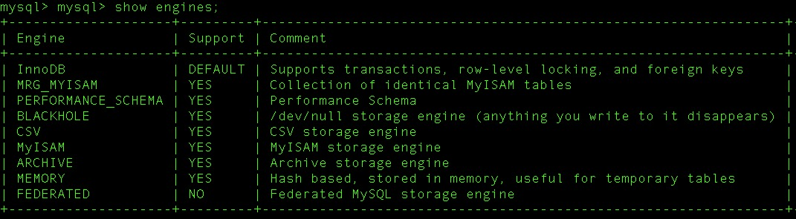
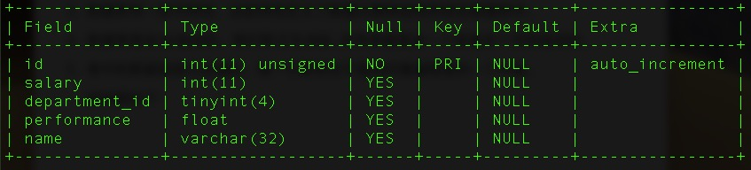
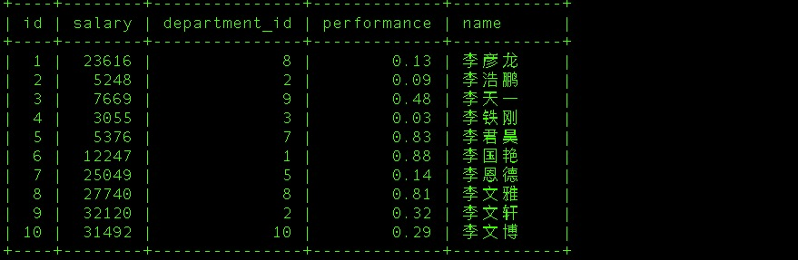

## 数据库存储的特点

1. 将数据放到表中，将表放到数据库中。
	

2. 一个数据库可以有多张表，每个表都有自己唯一的名字来标识自己。

   `show tables;`

   

3. 数据表有一些可特性，这些特性定义了数据以哪种结构存放在数据表中。

   `show engines;`

   

4. 数据表是由`列`组成的，我们称之为`字段` ,所有表都是由一个或者多个字段组成的。

   `desc staff;`

   

5. 表中的数据是按行存储的，每一行都类似于面向对象编程里的一个对象。

   `select * from staff limit 10;`

   

   