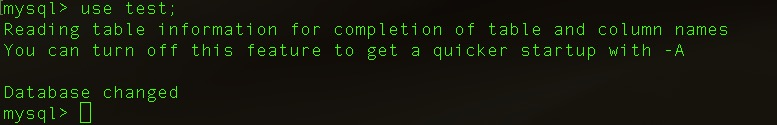

## 数据库相关命令

- 查看MySQL服务器中有什么数据库

  `show databases;`

  

- 创建数据库

  ```mysql
  -- 第一种创建方式
  CREATE DATABASE `my_test;
  -- 第二种创建方式
  CREATE DATABASE IF NOT EXISTS `my_test`;
  ```

  

- 查询建库语句

  `SHOW CREATE DATABASE 数据库名称;`

  

- 使用某一数据库

  `USE 数据库名称;`

  

- 查看当前在哪一个数据库中?

  `SELECT DATABASE();`

  

- 删除数据库

  `DROP DATABASE 数据库名称;`

  

