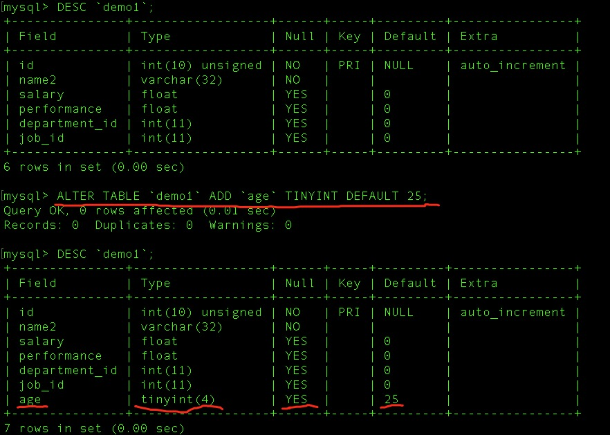
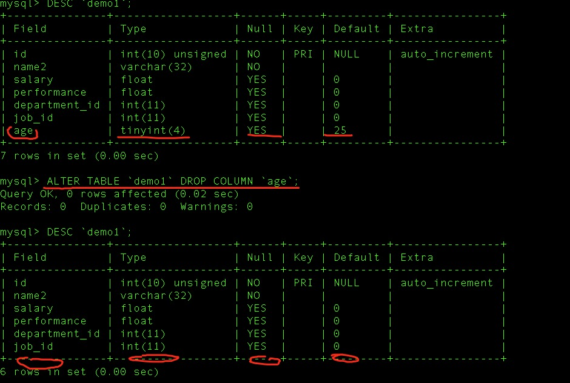
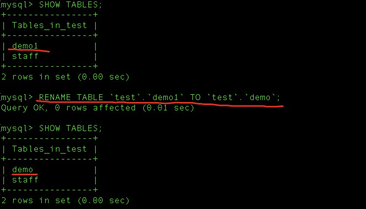
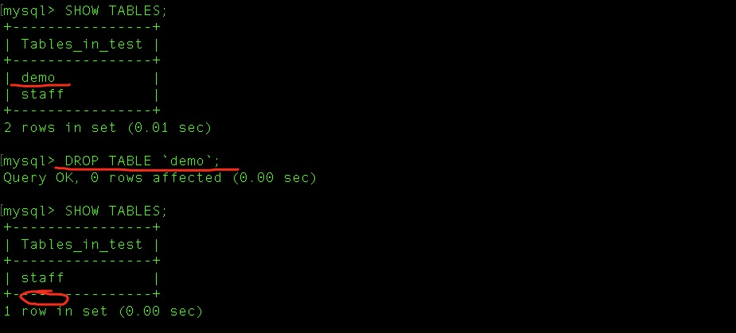

## 数据表操作

- 查看数据库下有什么数据表

  `SHOW TABLES;`

  

- 创建数据表

  ```mysql
  CREATE TABLE `demo2`(
  	`id` INT UNSIGNED NOT NULL AUTO_INCREMENT,
    `name` VARCHAR(32) DEFAULT NULL,
    `salary` FLOAT DEFAULT 0,
    `performance` FLOAT DEFAULT 0,
    `department_id` INT DEFAULT 0,
    `job_id` INT DEFAULT 0,
    PRIMARY KEY(ID)
  )ENGINE=Innodb DEFAULT CHARSET='utf8';
  ```

  

- 查看创建表语句

  `SHOW CREATE TABLE 表名\G`

  

- 查看表结构

  `DESC 表名;`

  

- 更改数据表字段名称和属性

  ```mysql
  -- 添加字段和属性
  ALTER TABLE `表名` ADD `字段` 添加字段的属性 
  -- 更改字段名称和属性
  ALTER TABLE `表名` CHANGE `字段名` `修改后的名字` 要修改的属性；
  -- 只更改字段的属性
  ALTER TABLE `表名` MODIFY `字段名` 要修改的属性；
  -- 删除指定的字段
  ALTER TABLE `表名` DROP COLUMN `字段名`;
  ```

  - 事例1 

    

  - 事例2

    

  - 事例3

    

  - 事例4

    

- 数据表更改名称

  

- 删除数据表

  `DROP TABLE 表名`

  

