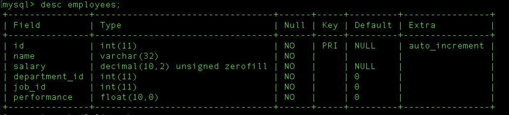
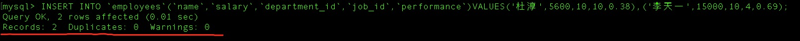

## 插入测试数据

- 创建数据库 `demo`

  ```mysql
  CREATE DATABASE IF NOT EXISTS `demo`;
  ```

- 创建数据表 `employees`

  ```mysql
  CREATE TABLE `employees` (
    `id` int(11) NOT NULL AUTO_INCREMENT,
    `name` varchar(32) NOT NULL DEFAULT '',
    `salary` decimal(10,2) unsigned NOT NULL,
    `department_id` int(11) NOT NULL DEFAULT '0',
    `job_id` int(11) NOT NULL DEFAULT '0',
    `performance` float(10,2) NOT NULL DEFAULT '0.00',
    PRIMARY KEY (`id`)
  ) ENGINE=InnoDB AUTO_INCREMENT=92302 DEFAULT CHARSET=utf8
  ```

  

- 单条插入

  ```mysql
  INSERT INTO `employees`(`name`,`salary`,`department_id`,`job_id`,`performance`)VALUES('李彦龙',1000.98,10,5,0.38);
  ```

  

- 批量插入

  ```mysql
  INSERT INTO `employees`(`name`,`salary`,`department_id`,`job_id`,`performance`)VALUES('杜淳',5600,10,10,0.38),('李天一',15000,10,4,0.69);
  ```

  

- 造数据

  ```python
  # 爬取姓名网 ，获取1000条数据 （https://www.yw11.com/namelist.php）
  
  import requests
  from lxml.html import etree
  import pymysql
  import random
  
  class NameItem():
      base_url = 'https://www.yw11.com/namelist.php'
      headers = {
          'User-Agent':'Mozilla/5.0 (Macintosh; Intel Mac OS X 10_14_5) AppleWebKit/537.36 (KHTML, like Gecko) Chrome/75.0.3770.100 Safari/537.36'
      }
  
      def __init__(self):
          pass
  
      def get_links(self):
          datalist = []
          response = requests.get(self.base_url,headers=self.headers)
          data = response.text
          html = etree.HTML(data)
          for row in html.xpath('//ul[@class="e3"]'):
              url = row.xpath('./li/a/@href')
              datalist = url
          return datalist
  
      def get_data(self,url):
          b_url = 'https://www.yw11.com'+url
          response = requests.get(b_url,headers=self.headers)
          response.encoding = 'utf-8'
          data = response.text
          html = etree.HTML(data)
          info = html.xpath("//div[@class='listbox1_text']/ul/li/text()")
          return info
  
  
  
  class DB():
  
      config = {
          "host":"127.0.0.1",
          "port":3306,
          "user":"root",
          "password":"ocnt-123",
          "database":"test",
          "charset":"utf8"
      }
  
      def __init__(self):
          try:
              self.conn = pymysql.connect(**self.config)
              if self.conn:
                  self.cursor = self.conn.cursor()
          except:
              pass
  
      def insert(self,data):
          try:
              sql = "insert into staff(`name`,`salary`,`department_id`,`performance`) values " + data
              self.cursor.execute(sql)
              self.conn.commit()
              return self.cursor.lastrowid
          except Exception as e:
              print(e)
              return 0
  
  
      def __del__(self):
          if self.cursor:
              self.cursor.close()
  
          if self.conn:
              self.conn.close()
  
  
  
  if __name__ == '__main__':
      nameitem = NameItem()
      db = DB()
      data = nameitem.get_links()
      for url in data:
          nameinfo = nameitem.get_data(url)
          str_sql = ""
          for name in nameinfo:
              names = name.strip()
              str_sql += "('{}',{},{},{}),".format(names,random.randint(2500,40000),random.randint(1,10),round(random.random(),2))
          sql = str_sql.strip(',')
          tmp = db.insert(sql)
          print(tmp)
    
  ```