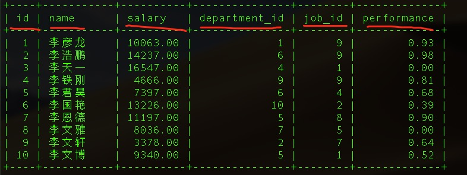
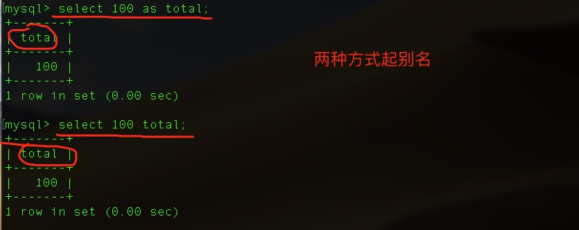
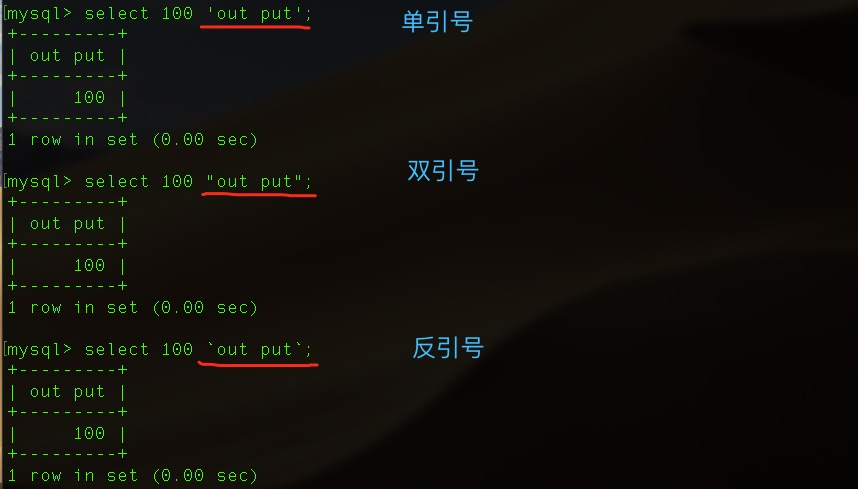
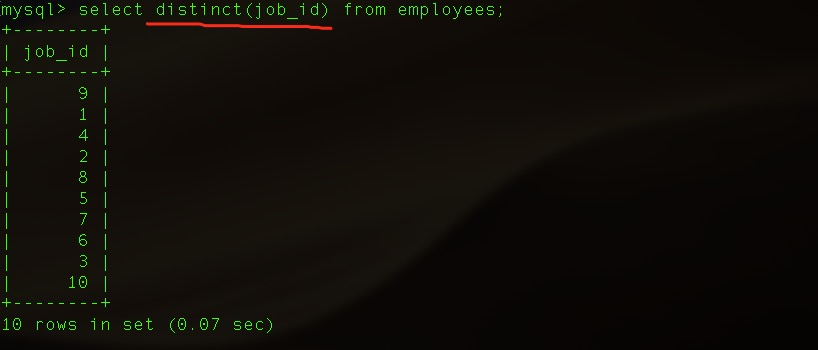
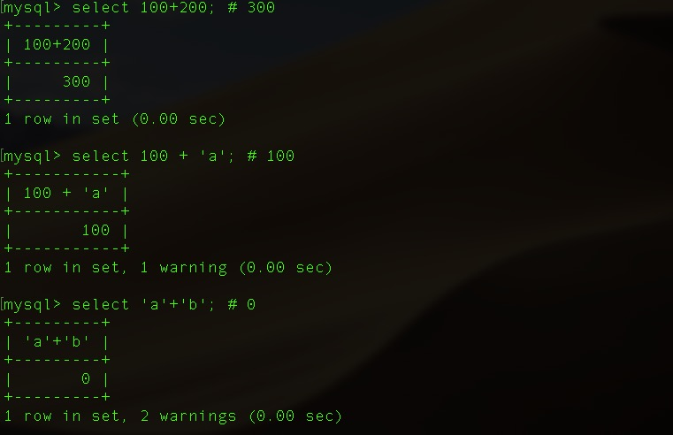
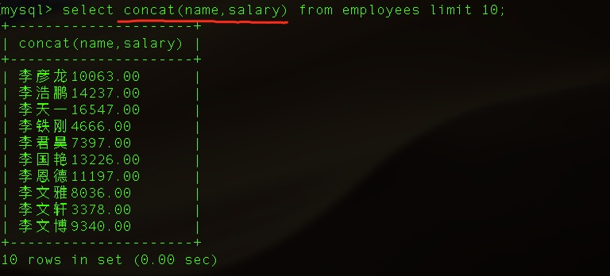
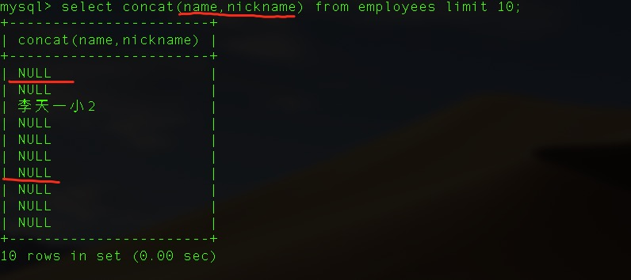
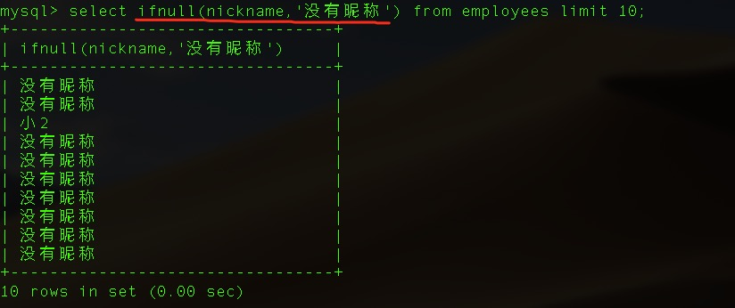

## 基础查询

- 查询单字段

  ```mysql
  select name from employees;
  ```

  

- 查询多字段

  ```mysql
  select name,salary,performance from employees;
  ```

  

- 查询所有

  ```mysql
  select * from employees;
  ```

  

- 查询常量

  ```mysql
  select 100;
  ```

  

- 查询函数

  ```mysql
  select version(); # 查询数据库版本
  select database(); # 查询在哪个数据库下
  ```

  

- 起别名

  ```mysql
  select 100 as total;
  ```

  ```mysql
  select 100 total;
  ```

  

- 如果别名为多个单词，需要使用引号

  ```mysql
  select 100 'out put';
  ```

  

- 数据去重

  ```mysql
  select distinct name from employees;
  ```

  

- `+` 号的作用: 只能做运算，如果不能转成数字，默认为0

  ```mysql
  select 100+200; # 300
  select 100 + 'a'; # 100
  select 'a'+'b'; # 0
  ```

  

- 字段连接 `concat(字段1，字段2)`

  - name和salary字段连接查询

    

  - 添加 nickname字段 varchar(32) 默认为null

    

  - name和nickname字段连接查询

    

  - 总结：

    - concat() 连接是将多个字段的值拼接到一起组成一个新的字符串。
    - 如果某一字段值为null，则整体为null

- ifnull(字段,默认值) 判断值是否为null

  